R Notebook
================
Joseph Kheir
4/11/2020

# Overview

One of the more widely accepted file formats to store cancer genomic
variant data is in the Mutation Annotation Format (MAF). MAF is a
tab-delimited text file with aggregated mutation information from VCF
Files (Mayakonda et al. 2018). Here we explore the use of MAF files and
demonstrate how to read & summarize MAF files. We will also demonstrate
how to visualize and analyse the data contained within the MAF files.
The data used in this module is from The Cancer Genome Atlas which aims
to study the relationships between patterns of mutations and epigenetic
phenotypes of adult de novo acute myeloid leukemia (AML) which consists
of genomes from 200 annotated adult cases of AML (Network et al. 2013).

## Reading & Summarizing MAF files

The read.maf function reads MAF files and provides a summary of various
aspects of the MAF file data. It is stored as a MAF object.

``` r
library(maftools)
#path to TCGA LAML MAF file
laml.maf = system.file('extdata', 'tcga_laml.maf.gz', package = 'maftools') 
#clinical information containing survival information and histology. This is optional
laml.clin = system.file('extdata', 'tcga_laml_annot.tsv', package = 'maftools') 

# The read.maf function reads MAF files and summarizes the file into a MAF object
laml = read.maf(maf = laml.maf, clinicalData = laml.clin)
```

    ## -Reading
    ## -Validating
    ## -Silent variants: 475 
    ## -Summarizing
    ## -Processing clinical data
    ## -Finished in 0.507s elapsed (0.735s cpu)

# MAF objects

In this example, the MAF object is the laml variable which is called
here. The MAF object summarizes the data and provides an associated
sample annotations.

``` r
#Typing laml shows basic summary of MAF file.
laml
```

    ## An object of class  MAF 
    ##                    ID          summary  Mean Median
    ##  1:        NCBI_Build               37    NA     NA
    ##  2:            Center genome.wustl.edu    NA     NA
    ##  3:           Samples              193    NA     NA
    ##  4:            nGenes             1241    NA     NA
    ##  5:   Frame_Shift_Del               52 0.271      0
    ##  6:   Frame_Shift_Ins               91 0.474      0
    ##  7:      In_Frame_Del               10 0.052      0
    ##  8:      In_Frame_Ins               42 0.219      0
    ##  9: Missense_Mutation             1342 6.990      7
    ## 10: Nonsense_Mutation              103 0.536      0
    ## 11:       Splice_Site               92 0.479      0
    ## 12:             total             1732 9.021      9

You can call a summary of the samples by using the function
getSampleSummary

``` r
# To show sample summary 
sampleSummary = getSampleSummary(laml)
head(sampleSummary)
```

    ##    Tumor_Sample_Barcode Frame_Shift_Del Frame_Shift_Ins In_Frame_Del
    ## 1:         TCGA-AB-3009               0               5            0
    ## 2:         TCGA-AB-2807               1               0            1
    ## 3:         TCGA-AB-2959               0               0            0
    ## 4:         TCGA-AB-3002               0               0            0
    ## 5:         TCGA-AB-2849               0               1            0
    ## 6:         TCGA-AB-2923               1               1            0
    ##    In_Frame_Ins Missense_Mutation Nonsense_Mutation Splice_Site total
    ## 1:            1                25                 2           1    34
    ## 2:            0                16                 3           4    25
    ## 3:            0                22                 0           1    23
    ## 4:            0                15                 1           5    21
    ## 5:            0                16                 1           2    20
    ## 6:            0                15                 3           0    20

Like getSampleSummary, you can call a summary of these genes in the file
by using the function getGeneSummary

``` r
# To Show gene summary.
geneSummary = getGeneSummary(laml)
head(geneSummary)
```

    ##    Hugo_Symbol Frame_Shift_Del Frame_Shift_Ins In_Frame_Del In_Frame_Ins
    ## 1:        FLT3               0               0            1           33
    ## 2:      DNMT3A               4               0            0            0
    ## 3:        NPM1               0              33            0            0
    ## 4:        IDH2               0               0            0            0
    ## 5:        IDH1               0               0            0            0
    ## 6:        TET2              10               4            0            0
    ##    Missense_Mutation Nonsense_Mutation Splice_Site total MutatedSamples
    ## 1:                15                 0           3    52             52
    ## 2:                39                 5           6    54             48
    ## 3:                 1                 0           0    34             33
    ## 4:                20                 0           0    20             20
    ## 5:                18                 0           0    18             18
    ## 6:                 4                 8           1    27             17
    ##    AlteredSamples
    ## 1:             52
    ## 2:             48
    ## 3:             33
    ## 4:             20
    ## 5:             18
    ## 6:             17

To show any clinical data associated with the studied samples, the
function getClinicalData can be used.

``` r
# To show clinical data associated with samples
clinData = getClinicalData(laml)
head(clinData)
```

    ##    Tumor_Sample_Barcode FAB_classification days_to_last_followup
    ## 1:         TCGA-AB-2802                 M4                   365
    ## 2:         TCGA-AB-2803                 M3                   792
    ## 3:         TCGA-AB-2804                 M3                  2557
    ## 4:         TCGA-AB-2805                 M0                   577
    ## 5:         TCGA-AB-2806                 M1                   945
    ## 6:         TCGA-AB-2807                 M1                   181
    ##    Overall_Survival_Status
    ## 1:                       1
    ## 2:                       1
    ## 3:                       0
    ## 4:                       1
    ## 5:                       1
    ## 6:                       1

The user can show all fields within the MAF file by using the function
getFields

``` r
# To show all fields in MAF
getFields(laml)
```

    ##  [1] "Hugo_Symbol"            "Entrez_Gene_Id"         "Center"                
    ##  [4] "NCBI_Build"             "Chromosome"             "Start_Position"        
    ##  [7] "End_Position"           "Strand"                 "Variant_Classification"
    ## [10] "Variant_Type"           "Reference_Allele"       "Tumor_Seq_Allele1"     
    ## [13] "Tumor_Seq_Allele2"      "Tumor_Sample_Barcode"   "Protein_Change"        
    ## [16] "i_TumorVAF_WU"          "i_transcript_name"

A summary report of the MAF file contents can be generated using the
.mafSummary function which writes a summary to a text file.

``` r
#Writes maf summary to an output file with basename laml.
write.mafSummary(maf = laml, basename = 'laml')
```

## Visualization

The MAF summary report can be put into graphical form using the
plotmafSummary function. This function will display the number of
variants in each sample in a stacked barplot format. Mean/median lines
can be added to this plot in order to visualize the average/ median
number of variants across the cohort. Additionally, variant types are
displayed as boxplots where the variant type is further sub-classified
into variant classifcations.

``` r
# Use plotmafSummary to plot the summary of the maf file.
plotmafSummary(maf = laml, rmOutlier = TRUE, addStat = 'median', dashboard = TRUE, titvRaw = FALSE)
```

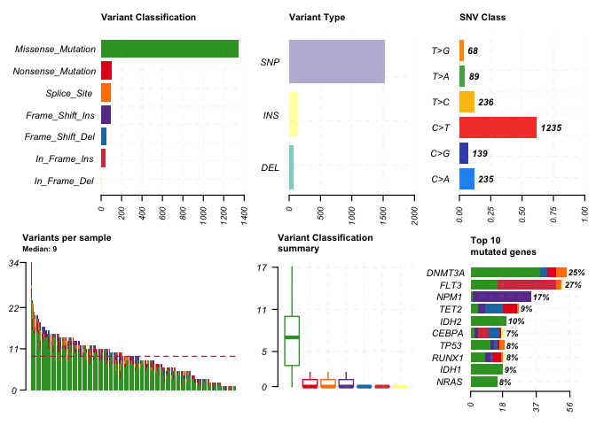<!-- --> The
MAF summary plot can be further represented using oncoplots, which are
also known as waterfall plots. The below demonstrates the top 10 mutated
genes and the nature of their mutation. Note: those that are annotated
as Multi-Hit are genes which are mutated more than once in the same
sample.

``` r
#oncoplot for top ten mutated genes.
oncoplot(maf = laml, top = 10)
```

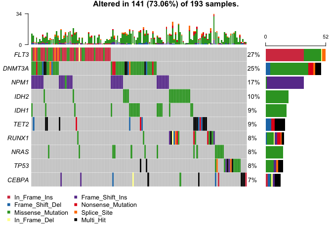<!-- --> If one is
interested in visualizing a specific set of genes, the function
oncostrip can be used to identify the mutation types of the particular
gene of interest.

``` r
# Oncostrip to visualize three genes and their mutation types
oncostrip(maf = laml, genes = c('DNMT3A','NPM1', 'RUNX1'))
```

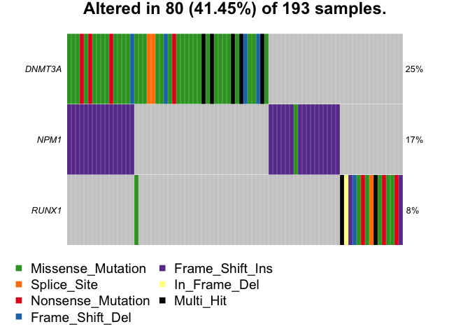<!-- --> The
function titv can represent transitions/ transversions classifications
for SNPs. It is depicted in summarized tables, boxplots or barplots.

``` r
# titv for SNP classification
laml.titv = titv(maf = laml, plot = FALSE, useSyn = TRUE)
#plot titv summary
plotTiTv(res = laml.titv)
```

<!-- -->
A lollipop plot can be used to visualize the mutation spots along the
length of a gene. Below, the DNMT3A gene is used as an example as the
most mutated gene in leukemia where each lolipop indicates a mutational
hotspot. In order to use the lollipop plot function, a column is
necessary indicating amino acid changes which is defaulted as AAChange
in the MAF file or can be explicitly declared using the AACol variable
within the function.

``` r
#lollipop plot for DNMT3A
lollipopPlot(maf = laml, gene = 'DNMT3A', AACol = 'Protein_Change', showMutationRate = TRUE)
```

    ## 3 transcripts available. Use arguments refSeqID or proteinID to manually specify tx name.

    ##      HGNC refseq.ID protein.ID aa.length
    ## 1: DNMT3A NM_175629  NP_783328       912
    ## 2: DNMT3A NM_022552  NP_072046       912
    ## 3: DNMT3A NM_153759  NP_715640       723

    ## Using longer transcript NM_175629 for now.

    ## Removed 3 mutations for which AA position was not available

<!-- -->

``` r
# Note that lollipopPlot warns user on availability of different transcripts for the given gene. If we know the transcript id before hand, we can specify it as refSeqID or proteinID. By default lollipopPlot uses the longer isoform.
```

``` r
# We can also label points on the lollipopPlot using argument labelPos. If labelPos is set to ‘all’, all of the points are highlighted.
lollipopPlot(maf = laml, gene = 'KIT', AACol = 'Protein_Change', labelPos = 816, refSeqID = 'NM_000222')
```

<!-- -->
Cancer, especially solid tumers, are characterized by regions of
hyper-mutations. These regions, also known as genomic loci, can be
visualized by plotting the inter variant distance on a linear genomic
scale and can be visualized using the function rainfallplot. If one is
interested in highlighting regions where changes in inter-event
distances are located, one can set detectChangePoints to “TRUE”.

``` r
# Plot a rainfallPlot
brca <- system.file("extdata", "brca.maf.gz", package = "maftools")
brca = read.maf(maf = brca, verbose = FALSE)
rainfallPlot(maf = brca, detectChangePoints = TRUE, pointSize = 0.6)
```

    ## Processing TCGA-A8-A08B..

    ## Kataegis detected at:

    ##    Chromosome Start_Position End_Position nMuts Avg_intermutation_dist Size
    ## 1:          8       98129348     98133560     7               702.0000 4212
    ## 2:          8       98398549     98403536     9               623.3750 4987
    ## 3:          8       98453076     98456466     9               423.7500 3390
    ## 4:          8      124090377    124096810    22               306.3333 6433
    ## 5:         12       97436055     97439705     7               608.3333 3650
    ## 6:         17       29332072     29336153     8               583.0000 4081
    ##    Tumor_Sample_Barcode C>G C>T
    ## 1:         TCGA-A8-A08B   4   3
    ## 2:         TCGA-A8-A08B   1   8
    ## 3:         TCGA-A8-A08B   1   8
    ## 4:         TCGA-A8-A08B   1  21
    ## 5:         TCGA-A8-A08B   4   3
    ## 6:         TCGA-A8-A08B   4   4

<!-- --> To
compare the median mutation load per gene in the MAF file against the
TCGA cohort, one can use the tcgaCompare function. The plot along the Y
axis is the log base 10 mutation load, and the X axis indicates the
different cancer types which are ordered based on their median mutation
load. Each dot within the plot represents a sample and each red line is
the median mutation load (Alexandrov et al. 2013).

``` r
# Use tcgaCompare to compare mutation load to TCGA cohort
laml.mutload = tcgaCompare(maf = laml, cohortName = 'Example-LAML')
```

    ## Performing pairwise t-test for differences in mutation burden..

<!-- -->
Variant allele frequencies can be plotted as a boxplot to quickly help
estimate clonal status of the top mutated genes.

``` r
plotVaf(maf = laml, vafCol = 'i_TumorVAF_WU')
```

<!-- --> A word
cloud can be plotted using the geneCloud function. The size of each gene
name is proportional to the total number of samples in which it is
mutated/ altered.

``` r
geneCloud(input = laml, minMut = 3)
```

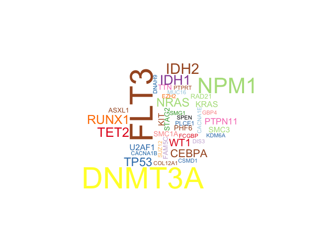<!-- -->

## Analysis

Many cancer genes are either co-occuring or occure exclusively in their
mutation pattern. These exclusive/ co-occuring gene sets can be detected
using the somaticInteractions function which performs a pair-wise
Fisher’s Exact test to test for significantly paired
genes.

``` r
somaticInteractions(maf = laml, top = 25, pvalue = c(0.05, 0.1))
```

<!-- -->

    ##      gene1  gene2       pValue oddsRatio  00 11 01 10              Event
    ##   1: ASXL1  RUNX1 0.0001541586 55.215541 176  4 12  1       Co_Occurence
    ##   2:  IDH2  RUNX1 0.0002809928  9.590877 164  7  9 13       Co_Occurence
    ##   3:  IDH2  ASXL1 0.0004030636 41.077327 172  4  1 16       Co_Occurence
    ##   4:  FLT3   NPM1 0.0009929836  3.763161 125 17 16 35       Co_Occurence
    ##   5:  SMC3 DNMT3A 0.0010451985 20.177713 144  6 42  1       Co_Occurence
    ##  ---                                                                    
    ## 296: PLCE1  ASXL1 1.0000000000  0.000000 184  0  5  4 Mutually_Exclusive
    ## 297: RAD21  FAM5C 1.0000000000  0.000000 183  0  5  5 Mutually_Exclusive
    ## 298: PLCE1  FAM5C 1.0000000000  0.000000 184  0  5  4 Mutually_Exclusive
    ## 299: PLCE1  RAD21 1.0000000000  0.000000 184  0  5  4 Mutually_Exclusive
    ## 300:  EZH2  PLCE1 1.0000000000  0.000000 186  0  4  3 Mutually_Exclusive
    ##              pair event_ratio
    ##   1: ASXL1, RUNX1        4/13
    ##   2:  IDH2, RUNX1        7/22
    ##   3:  ASXL1, IDH2        4/17
    ##   4:   FLT3, NPM1       17/51
    ##   5: DNMT3A, SMC3        6/43
    ##  ---                         
    ## 296: ASXL1, PLCE1         0/9
    ## 297: FAM5C, RAD21        0/10
    ## 298: FAM5C, PLCE1         0/9
    ## 299: PLCE1, RAD21         0/9
    ## 300:  EZH2, PLCE1         0/7

The function oncodrive is an algorithm that is used to take advantage of
cancer genomics. Per the literature, most cancer causing gene variants
occur in regions called hot spots. The genomic regions of variant
clustering are exploited by the oncodrive algorithm to detect and
identify cancer genes (Tamborero, Gonzalez-Perez, and Lopez-Bigas
2013).

``` r
# maftools has a function oncodrive which identifies cancer genes from a given MAF
laml.sig = oncodrive(maf = laml, AACol = 'Protein_Change', minMut = 5, pvalMethod = 'zscore')
```

    ## Warning in oncodrive(maf = laml, AACol = "Protein_Change", minMut = 5,
    ## pvalMethod = "zscore"): Oncodrive has been superseeded by OncodriveCLUSTL. See
    ## http://bg.upf.edu/group/projects/oncodrive-clust.php

    ## Estimating background scores from synonymous variants..

    ## Not enough genes to build background. Using predefined values. (Mean = 0.279; SD = 0.13)

    ## Estimating cluster scores from non-syn variants..

    ##   |                                                                              |                                                                      |   0%  |                                                                              |===                                                                   |   4%  |                                                                              |======                                                                |   9%  |                                                                              |=========                                                             |  13%  |                                                                              |============                                                          |  17%  |                                                                              |===============                                                       |  22%  |                                                                              |==================                                                    |  26%  |                                                                              |=====================                                                 |  30%  |                                                                              |========================                                              |  35%  |                                                                              |===========================                                           |  39%  |                                                                              |==============================                                        |  43%  |                                                                              |=================================                                     |  48%  |                                                                              |=====================================                                 |  52%  |                                                                              |========================================                              |  57%  |                                                                              |===========================================                           |  61%  |                                                                              |==============================================                        |  65%  |                                                                              |=================================================                     |  70%  |                                                                              |====================================================                  |  74%  |                                                                              |=======================================================               |  78%  |                                                                              |==========================================================            |  83%  |                                                                              |=============================================================         |  87%  |                                                                              |================================================================      |  91%  |                                                                              |===================================================================   |  96%  |                                                                              |======================================================================| 100%

    ## Comapring with background model and estimating p-values..

    ## Done !

``` r
head(laml.sig)
```

    ##    Hugo_Symbol Frame_Shift_Del Frame_Shift_Ins In_Frame_Del In_Frame_Ins
    ## 1:        IDH1               0               0            0            0
    ## 2:        IDH2               0               0            0            0
    ## 3:        NPM1               0              33            0            0
    ## 4:        NRAS               0               0            0            0
    ## 5:       U2AF1               0               0            0            0
    ## 6:         KIT               1               1            0            1
    ##    Missense_Mutation Nonsense_Mutation Splice_Site total MutatedSamples
    ## 1:                18                 0           0    18             18
    ## 2:                20                 0           0    20             20
    ## 3:                 1                 0           0    34             33
    ## 4:                15                 0           0    15             15
    ## 5:                 8                 0           0     8              8
    ## 6:                 7                 0           0    10              8
    ##    AlteredSamples clusters muts_in_clusters clusterScores protLen   zscore
    ## 1:             18        1               18     1.0000000     414 5.546154
    ## 2:             20        2               20     1.0000000     452 5.546154
    ## 3:             33        2               32     0.9411765     294 5.093665
    ## 4:             15        2               15     0.9218951     189 4.945347
    ## 5:              8        1                7     0.8750000     240 4.584615
    ## 6:              8        2                9     0.8500000     976 4.392308
    ##            pval          fdr fract_muts_in_clusters
    ## 1: 1.460110e-08 1.022077e-07              1.0000000
    ## 2: 1.460110e-08 1.022077e-07              1.0000000
    ## 3: 1.756034e-07 8.194826e-07              0.9411765
    ## 4: 3.800413e-07 1.330144e-06              1.0000000
    ## 5: 2.274114e-06 6.367520e-06              0.8750000
    ## 6: 5.607691e-06 1.308461e-05              0.9000000

One can plot the results of the oncodrive output using the function
plotOncodrive. The plot is in the form of a scatter plot where the size
of the points are proportional to the number of clusters found in the
gene.

``` r
# We can plot the results using plotOncodrive
plotOncodrive(res = laml.sig, fdrCutOff = 0.1, useFraction = TRUE)
```

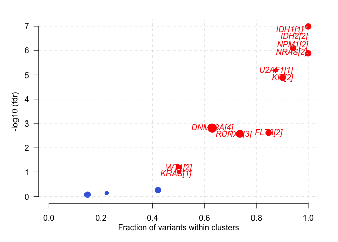<!-- --> If
knowing what domain in a given cancer cohort is most frequently
affected, pfamDomain, which summarizes amino acid changes according to
affected domains can be
    used.

``` r
laml.pfam = pfamDomains(maf = laml, AACol = 'Protein_Change', top = 10)
```

    ## Warning in pfamDomains(maf = laml, AACol = "Protein_Change", top = 10): Removed
    ## 50 mutations for which AA position was not available

<!-- -->

``` r
#Protein summary (first 7 columns)
head(laml.pfam$proteinSummary[,1:7, with = FALSE])
```

    ##      HGNC AAPos Variant_Classification  N total  fraction   DomainLabel
    ## 1: DNMT3A   882      Missense_Mutation 27    54 0.5000000 AdoMet_MTases
    ## 2:   IDH1   132      Missense_Mutation 18    18 1.0000000      PTZ00435
    ## 3:   IDH2   140      Missense_Mutation 17    20 0.8500000      PTZ00435
    ## 4:   FLT3   835      Missense_Mutation 14    52 0.2692308      PKc_like
    ## 5:   FLT3   599           In_Frame_Ins 10    52 0.1923077      PKc_like
    ## 6:  U2AF1    34      Missense_Mutation  7     8 0.8750000       zf-CCCH

``` r
#Domain summary (first 3 columns)
head(laml.pfam$domainSummary[,1:3, with = FALSE])
```

    ##        DomainLabel nMuts nGenes
    ## 1:        PKc_like    55      5
    ## 2:        PTZ00435    38      2
    ## 3:   AdoMet_MTases    33      1
    ## 4:           7tm_1    24     24
    ## 5:         COG5048    17     17
    ## 6: Cadherin_repeat    16     16

If we are interested in comparing our cohort mutations across other
cancer cohorts, we can use the mutsig function for pan-cancer comparison
study.

``` r
#MutsigCV results for TCGA-AML
laml.mutsig <- system.file("extdata", "LAML_sig_genes.txt.gz", package = "maftools")
pancanComparison(mutsigResults = laml.mutsig, qval = 0.1, cohortName = 'LAML', inputSampleSize = 200, label = 1)
```

    ## Significantly mutated genes in LAML (q < 0.1): 23

    ## Significantly mutated genes in PanCan cohort (q <0.1): 114

    ## Significantly mutated genes exclusive to LAML (q < 0.1):

    ##       gene pancan            q nMut log_q_pancan     log_q
    ##  1:  CEBPA  1.000 3.500301e-12   13   0.00000000 11.455895
    ##  2:   EZH2  1.000 7.463546e-05    3   0.00000000  4.127055
    ##  3: GIGYF2  1.000 6.378338e-03    2   0.00000000  2.195292
    ##  4:    KIT  0.509 1.137517e-05    8   0.29328222  4.944042
    ##  5:   PHF6  0.783 6.457555e-09    6   0.10623824  8.189932
    ##  6: PTPN11  0.286 7.664584e-03    9   0.54363397  2.115511
    ##  7:  RAD21  0.929 1.137517e-05    5   0.03198429  4.944042
    ##  8:  SMC1A  0.801 2.961696e-03    6   0.09636748  2.528460
    ##  9:   TET2  0.907 2.281625e-13   17   0.04239271 12.641756
    ## 10:    WT1  1.000 2.281625e-13   12   0.00000000 12.641756

<!-- -->

    ##          gene   pancan            q nMut log_q_pancan    log_q
    ##   1:   ACVR1B 6.11e-02 1.000000e+00    0     1.213959  0.00000
    ##   2:     AKT1 2.68e-10 1.000000e+00    0     9.571865  0.00000
    ##   3:      APC 1.36e-13 1.000000e+00    0    12.866461  0.00000
    ##   4:    APOL2 7.96e-03 1.000000e+00    0     2.099087  0.00000
    ##   5: ARHGAP35 2.32e-12 1.000000e+00    1    11.634512  0.00000
    ##  ---                                                          
    ## 120:    U2AF1 4.07e-08 4.503311e-13    8     7.390406 12.34647
    ## 121:      VHL 2.32e-12 1.000000e+00    0    11.634512  0.00000
    ## 122:      WT1 1.00e+00 2.281625e-13   12     0.000000 12.64176
    ## 123:   ZNF180 8.60e-02 1.000000e+00    0     1.065502  0.00000
    ## 124:   ZNF483 2.37e-02 1.000000e+00    0     1.625252  0.00000

Since survival data can be contained in the MAF file, or in a separate
file, a survival analysis study can be performed. The function
mafSurvive performs the survival analysis by performing a kaplan meier
curve by grouping samples based on mutation status.

``` r
#Survival analysis based on grouping of DNMT3A mutation status
mafSurvival(maf = laml, genes = 'DNMT3A', time = 'days_to_last_followup', Status = 'Overall_Survival_Status', isTCGA = TRUE)
```

    ## Looking for clinical data in annoatation slot of MAF..

    ## Number of mutated samples for given genes:

    ## DNMT3A 
    ##     48

    ## Removed 11 samples with NA's

    ## Median survival..

    ##     Group medianTime   N
    ## 1: Mutant        245  45
    ## 2:     WT        396 137

<!-- -->
Using the survGroup function, we can identify sets of genes that result
in poor survival
rates.

``` r
#Using top 20 mutated genes to identify a sets of genes to predict poor prognostic groups
prog_geneset = survGroup(maf = laml, top = 20, geneSetSize = 2, time = "days_to_last_followup", Status = "Overall_Survival_Status", verbose = FALSE)
```

    ## Removed 11 samples with NA's

``` r
print(prog_geneset)
```

    ##     Gene_combination P_value    hr  WT Mutant
    ##  1:      FLT3_DNMT3A 0.00104 2.510 164     18
    ##  2:      DNMT3A_SMC3 0.04880 2.220 176      6
    ##  3:      DNMT3A_NPM1 0.07190 1.720 166     16
    ##  4:      DNMT3A_TET2 0.19600 1.780 176      6
    ##  5:        FLT3_TET2 0.20700 1.860 177      5
    ##  6:        NPM1_IDH1 0.21900 0.495 176      6
    ##  7:      DNMT3A_IDH1 0.29300 1.500 173      9
    ##  8:       IDH2_RUNX1 0.31800 1.580 176      6
    ##  9:        FLT3_NPM1 0.53600 1.210 165     17
    ## 10:      DNMT3A_IDH2 0.68000 0.747 178      4
    ## 11:      DNMT3A_NRAS 0.99200 0.986 178      4

The function mafSurvGroup provides a KM curve for the results from the
gene combinations associated with poor survival.

``` r
# Draw KM curve for above results with the function mafSurvGroup
mafSurvGroup(maf = laml, geneSet = c("DNMT3A", "FLT3"), time = "days_to_last_followup", Status = "Overall_Survival_Status")
```

    ## Looking for clinical data in annoatation slot of MAF..

    ## Removed 11 samples with NA's

    ## Median survival..

    ##     Group medianTime   N
    ## 1: Mutant      242.5  18
    ## 2:     WT      379.5 164

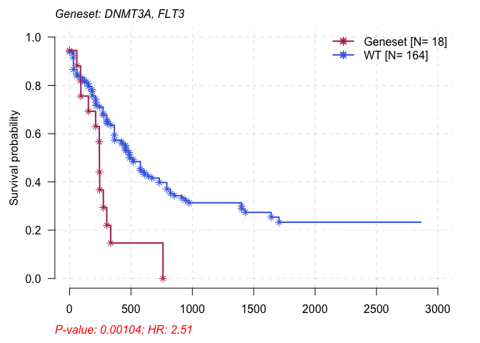<!-- --> To
test and identify differences in two cohorts of the same cancer for
differentially mutated genes, we can use the function mafCompare, which
performs Fisher tests on all genes between the two cohorts. This is
useful since many cancers differ from each other in terms of their
mutation pattern.

``` r
#Primary APL MAF
primary.apl = system.file("extdata", "APL_primary.maf.gz", package = "maftools")
primary.apl = read.maf(maf = primary.apl)
```

    ## -Reading
    ## -Validating
    ## --Non MAF specific values in Variant_Classification column:
    ##   ITD
    ## -Silent variants: 45 
    ## -Summarizing
    ## -Processing clinical data
    ## --Missing clinical data
    ## -Finished in 0.132s elapsed (0.252s cpu)

``` r
#Relapse APL MAF
relapse.apl = system.file("extdata", "APL_relapse.maf.gz", package = "maftools")
relapse.apl = read.maf(maf = relapse.apl)
```

    ## -Reading
    ## -Validating
    ## --Non MAF specific values in Variant_Classification column:
    ##   ITD
    ## -Silent variants: 19 
    ## -Summarizing
    ## -Processing clinical data
    ## --Missing clinical data
    ## -Finished in 0.104s elapsed (0.203s cpu)

``` r
#Considering only genes which are mutated in at-least 5 samples in one of the cohort to avoid bias due to genes mutated in single sample.
pt.vs.rt <- mafCompare(m1 = primary.apl, m2 = relapse.apl, m1Name = 'Primary', m2Name = 'Relapse', minMut = 5)
print(pt.vs.rt)
```

    ## $results
    ##    Hugo_Symbol Primary Relapse         pval         or       ci.up      ci.low
    ## 1:         PML       1      11 1.529935e-05 0.03537381   0.2552937 0.000806034
    ## 2:        RARA       0       7 2.574810e-04 0.00000000   0.3006159 0.000000000
    ## 3:       RUNX1       1       5 1.310500e-02 0.08740567   0.8076265 0.001813280
    ## 4:        FLT3      26       4 1.812779e-02 3.56086275  14.7701728 1.149009169
    ## 5:      ARID1B       5       8 2.758396e-02 0.26480490   0.9698686 0.064804160
    ## 6:         WT1      20      14 2.229087e-01 0.60619329   1.4223101 0.263440988
    ## 7:        KRAS       6       1 4.334067e-01 2.88486293 135.5393108 0.337679367
    ## 8:        NRAS      15       4 4.353567e-01 1.85209500   8.0373994 0.553883512
    ## 9:      ARID1A       7       4 7.457274e-01 0.80869223   3.9297309 0.195710173
    ##         adjPval
    ## 1: 0.0001376942
    ## 2: 0.0011586643
    ## 3: 0.0393149868
    ## 4: 0.0407875250
    ## 5: 0.0496511201
    ## 6: 0.3343630535
    ## 7: 0.4897762916
    ## 8: 0.4897762916
    ## 9: 0.7457273717
    ## 
    ## $SampleSummary
    ##     Cohort SampleSize
    ## 1: Primary        124
    ## 2: Relapse         58

The above table demonstrates that the two genes PML and RARA are highly
mutated in relapse APL versus primary APL. We can further visualize
these results graphically using the forestPlot
function.

``` r
forestPlot(mafCompareRes = pt.vs.rt, pVal = 0.1, color = c('royalblue', 'maroon'), geneFontSize = 0.8)
```

<!-- --> We can
demonstrated the above results by generating two oncoplots side by side
for both the primary and relapse APL cohort by using the function
coOncoplot.

``` r
genes = c("PML", "RARA", "RUNX1", "ARID1B", "FLT3")
coOncoplot(m1 = primary.apl, m2 = relapse.apl, m1Name = 'PrimaryAPL', m2Name = 'RelapseAPL', genes = genes, removeNonMutated = TRUE)
```

<!-- --> If
one is interested, gene-wise differences between the two cohorts can be
compared and analyzed using the function
lollipopPlot2.

``` r
lollipopPlot2(m1 = primary.apl, m2 = relapse.apl, gene = "PML", AACol1 = "amino_acid_change", AACol2 = "amino_acid_change", m1_name = "Primary", m2_name = "Relapse")
```

    ## Gene: PML

    ## 9 transcripts available. Use arguments refSeqID or proteinID to manually specify tx name.

    ##    HGNC refseq.ID protein.ID aa.length
    ## 1:  PML NM_033238  NP_150241       882
    ## 2:  PML NM_002675  NP_002666       633
    ## 3:  PML NM_033249  NP_150252       585
    ## 4:  PML NM_033247  NP_150250       435
    ## 5:  PML NM_033239  NP_150242       829
    ## 6:  PML NM_033250  NP_150253       781
    ## 7:  PML NM_033240  NP_150243       611
    ## 8:  PML NM_033244  NP_150247       560
    ## 9:  PML NM_033246  NP_150249       423

    ## Using longer transcript NM_033238 for now.
    ## 9 transcripts available. Use arguments refSeqID or proteinID to manually specify tx name.

    ##    HGNC refseq.ID protein.ID aa.length
    ## 1:  PML NM_033238  NP_150241       882
    ## 2:  PML NM_002675  NP_002666       633
    ## 3:  PML NM_033249  NP_150252       585
    ## 4:  PML NM_033247  NP_150250       435
    ## 5:  PML NM_033239  NP_150242       829
    ## 6:  PML NM_033250  NP_150253       781
    ## 7:  PML NM_033240  NP_150243       611
    ## 8:  PML NM_033244  NP_150247       560
    ## 9:  PML NM_033246  NP_150249       423

    ## Using longer transcript NM_033238 for now.

<!-- -->
Another function, clinicalEnrichment can be used to perform enrichment
analysis on any clinical feature associated with the samples being
studied. The function performs pairwise or groupwise comparison analyses
to identify enriched mutations for every category of clinical
featuers.

``` r
fab.ce = clinicalEnrichment(maf = laml, clinicalFeature = 'FAB_classification')
```

    ## Sample size per factor in FAB_classification:

    ## 
    ## M0 M1 M2 M3 M4 M5 M6 M7 
    ## 19 44 44 21 39 19  3  3

``` r
#Results are returned as a list. Significant associations p-value < 0.05
fab.ce$groupwise_comparision[p_value < 0.05]
```

    ##    Hugo_Symbol Group1 Group2 n_mutated_group1 n_mutated_group2      p_value
    ## 1:        IDH1     M1   Rest         11 of 44         7 of 149 0.0002597371
    ## 2:        TP53     M7   Rest           3 of 3        12 of 190 0.0003857187
    ## 3:      DNMT3A     M5   Rest         10 of 19        38 of 174 0.0057610493
    ## 4:       CEBPA     M2   Rest          7 of 44         6 of 149 0.0117352110
    ## 5:       RUNX1     M0   Rest          5 of 19        11 of 174 0.0117436825
    ## 6:        NPM1     M5   Rest          7 of 19        26 of 174 0.0248582372
    ## 7:       CEBPA     M1   Rest          6 of 44         7 of 149 0.0478737468
    ##    OR_low   OR_high       fdr
    ## 1:      0 0.3926994 0.0308575
    ## 2:      0 0.1315271 0.0308575
    ## 3:      0 0.6406007 0.3072560
    ## 4:      0 0.6874270 0.3757978
    ## 5:      0 0.6466787 0.3757978
    ## 6:      0 0.8342897 0.6628863
    ## 7:      0 0.9869971 1.0000000

``` r
# You can also plot the results of ClinicalEnrichment using plotEnrichmentResults
plotEnrichmentResults(enrich_res = fab.ce, pVal = 0.05)
```

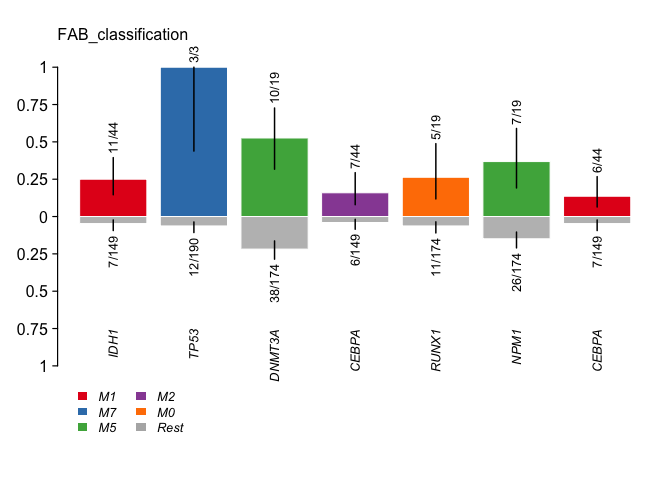<!-- -->
Another analysis which can be done is drug-gene interacations. The
function drugInteractions checks for drug-gene interactions and gene
druggability information. This information is provided by the Drug Gene
Interaction database which is a curation of “drug–gene interactions and
gene druggability information from papers, databases and web resources”
(Cotto et al. 2017 &
@Griffith).

``` r
dgi = drugInteractions(maf = laml, fontSize = 0.75)
```

<!-- -->

``` r
# Above plot shows potential druggable gene categories along with upto top 5 genes involved in them. One can also extract information on drug-gene interactions.
dnmt3a.dgi = drugInteractions(genes = "DNMT3A", drugs = TRUE)
```

    ## Number of claimed drugs for given genes:
    ##      Gene N
    ## 1: DNMT3A 7

``` r
#Printing selected columns.
dnmt3a.dgi[,.(Gene, interaction_types, drug_name, drug_claim_name)]
```

    ##      Gene interaction_types    drug_name drug_claim_name
    ## 1: DNMT3A                                            N/A
    ## 2: DNMT3A                   DAUNORUBICIN    Daunorubicin
    ## 3: DNMT3A                     DECITABINE      Decitabine
    ## 4: DNMT3A                     IDARUBICIN      IDARUBICIN
    ## 5: DNMT3A                     DECITABINE      DECITABINE
    ## 6: DNMT3A         inhibitor   DECITABINE   CHEMBL1201129
    ## 7: DNMT3A         inhibitor  AZACITIDINE      CHEMBL1489

To check for known oncogenic signaling pathways in the TCGA cohort, one
can use the function OncogenicPathways for analysis.

``` r
OncogenicPathways(maf = laml)
```

    ## Pathway alteration fractions

    ##        Pathway  N n_affected_genes fraction_affected
    ##  1:    RTK-RAS 85               18        0.21176471
    ##  2:      Hippo 38                7        0.18421053
    ##  3:      NOTCH 71                6        0.08450704
    ##  4:        MYC 13                3        0.23076923
    ##  5:        WNT 68                3        0.04411765
    ##  6:       TP53  6                2        0.33333333
    ##  7:       NRF2  3                1        0.33333333
    ##  8:       PI3K 29                1        0.03448276
    ##  9: Cell_Cycle 15                0        0.00000000
    ## 10:   TGF-Beta  7                0        0.00000000

<!-- -->
Its also possible to visualize the complete signaling
pathway.

``` r
# Note: Tumor suppressor genes are in red, and oncogenes are in blue font.
PlotOncogenicPathways(maf = laml, pathways = "RTK-RAS")
```

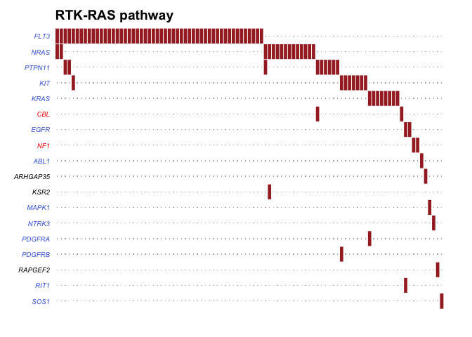<!-- --> The
concept of mutational signatures is based on that fact that as cancer
disease pathogenesis progresses, signautres in the form of nucleotide
substitutions in a specific pattern are left behind. These signatures
can be extracted by generating a mutation matrix of adjacent bases
surrounding the mutated base. The mutations can be classified into 96
substitution classes based on the surrounding bases.

``` r
#Requires BSgenome object
library(BSgenome.Hsapiens.UCSC.hg19, quietly = TRUE)
```

    ## 
    ## Attaching package: 'BiocGenerics'

    ## The following objects are masked from 'package:parallel':
    ## 
    ##     clusterApply, clusterApplyLB, clusterCall, clusterEvalQ,
    ##     clusterExport, clusterMap, parApply, parCapply, parLapply,
    ##     parLapplyLB, parRapply, parSapply, parSapplyLB

    ## The following objects are masked from 'package:stats':
    ## 
    ##     IQR, mad, sd, var, xtabs

    ## The following objects are masked from 'package:base':
    ## 
    ##     anyDuplicated, append, as.data.frame, basename, cbind, colnames,
    ##     dirname, do.call, duplicated, eval, evalq, Filter, Find, get, grep,
    ##     grepl, intersect, is.unsorted, lapply, Map, mapply, match, mget,
    ##     order, paste, pmax, pmax.int, pmin, pmin.int, Position, rank,
    ##     rbind, Reduce, rownames, sapply, setdiff, sort, table, tapply,
    ##     union, unique, unsplit, which, which.max, which.min

    ## 
    ## Attaching package: 'S4Vectors'

    ## The following object is masked from 'package:base':
    ## 
    ##     expand.grid

    ## 
    ## Attaching package: 'Biostrings'

    ## The following object is masked from 'package:base':
    ## 
    ##     strsplit

``` r
laml.tnm = trinucleotideMatrix(maf = laml, prefix = 'chr', add = TRUE, ref_genome = "BSgenome.Hsapiens.UCSC.hg19")
```

    ## Warning in trinucleotideMatrix(maf = laml, prefix = "chr", add = TRUE, ref_genome = "BSgenome.Hsapiens.UCSC.hg19"): Chromosome names in MAF must match chromosome names in reference genome.
    ## Ignorinig 101 single nucleotide variants from missing chromosomes chr23

    ## -Extracting 5' and 3' adjacent bases
    ## -Extracting +/- 20bp around mutated bases for background C>T estimation
    ## -Estimating APOBEC enrichment scores
    ## --Performing one-way Fisher's test for APOBEC enrichment
    ## ---APOBEC related mutations are enriched in  3.315 % of samples (APOBEC enrichment score > 2 ;  6  of  181  samples)
    ## -Creating mutation matrix
    ## --matrix of dimension 188x96

APOBEC Enrichment Estimation Apolipoprotein B mRNA editing enzyme
(APOBEC) is an evolutionary catalytic cytedine deaminase enzyme used in
RNA editing (Roberts et al. 2013). Per the literature, APOBEC induced
mutation are frequent in tumors and are associated with C to T
transitions. Since one of the functions of the trinucleotideMatrix
function is to estimate APOBEC enrichment, enrichment of C to T
mutations occuring witin a TCW motif over all C to T mutations within a
given sample are compared to background cytosines and TCW motifs
occuring within the mutated bases. A one sided fisher’s exact test is
performed for statistical evaluation of the results.

We can also analyze the differences in mutational patterns between
APOBEC and Non-APOBEC enriched samples by using the function,
plotApobecDiff. plotApobecDiff takes APOBEC enrichment scores estimated
earlier in the trinucleotideMatrix function and categorizes them as
APOBEC or non-APOBEC enriched and subsequently compares the two groups
for differentially altered
genes.

``` r
plotApobecDiff(tnm = laml.tnm, maf = laml, pVal = 0.2)
```

<!-- -->

    ## $results
    ##      Hugo_Symbol Enriched nonEnriched       pval        or      ci.up
    ##   1:        TP53        2          13 0.08175632 5.9976455  46.608861
    ##   2:        TET2        1          16 0.45739351 1.9407002  18.983979
    ##   3:        FLT3        2          45 0.65523131 1.4081851  10.211621
    ##   4:      DNMT3A        1          47 1.00000000 0.5335362   4.949499
    ##   5:      ADAM11        0           2 1.00000000 0.0000000 164.191472
    ##  ---                                                                 
    ## 132:         WAC        0           2 1.00000000 0.0000000 164.191472
    ## 133:         WT1        0          12 1.00000000 0.0000000  12.690862
    ## 134:      ZBTB33        0           2 1.00000000 0.0000000 164.191472
    ## 135:      ZC3H18        0           2 1.00000000 0.0000000 164.191472
    ## 136:      ZNF687        0           2 1.00000000 0.0000000 164.191472
    ##          ci.low adjPval
    ##   1: 0.49875432       1
    ##   2: 0.03882963       1
    ##   3: 0.12341748       1
    ##   4: 0.01101929       1
    ##   5: 0.00000000       1
    ##  ---                   
    ## 132: 0.00000000       1
    ## 133: 0.00000000       1
    ## 134: 0.00000000       1
    ## 135: 0.00000000       1
    ## 136: 0.00000000       1
    ## 
    ## $SampleSummary
    ##         Cohort SampleSize  Mean Median
    ## 1:    Enriched          6 7.167    6.5
    ## 2: nonEnriched        172 9.715    9.0

The following steps are the workflow of signature analysis 1.
estimateSignatures - which runs NMF on a range of values and measures
the goodness of fit - in terms of Cophenetic correlation. 2.
plotCophenetic - which draws an elblow plot and helps you to decide
optimal number of signatures. Best possible signature is the value at
which Cophenetic correlation drops significantly. 3. extractSignatures -
uses non-negative matrix factorization to decompose the matrix into n
signatures. n is chosen based on the above two steps. In case if you
already have a good estimate of n, you can skip above two steps. 4.
compareSignatures - extracted signatures from above step can be compared
to known signatures11 from COSMIC database, and cosine similarity is
calculated to identify best match. 5. plotSignatures - plots signatures

``` r
library('NMF')
```

    ## Loading required package: pkgmaker

    ## Loading required package: registry

    ## 
    ## Attaching package: 'pkgmaker'

    ## The following object is masked from 'package:S4Vectors':
    ## 
    ##     new2

    ## Loading required package: rngtools

    ## Loading required package: cluster

    ## NMF - BioConductor layer [OK] | Shared memory capabilities [NO: bigmemory] | Cores 3/4

    ##   To enable shared memory capabilities, try: install.extras('
    ## NMF
    ## ')

    ## 
    ## Attaching package: 'NMF'

    ## The following object is masked from 'package:S4Vectors':
    ## 
    ##     nrun

``` r
laml.sign = estimateSignatures(mat = laml.tnm, nTry = 6, pConstant = 1)
```

    ## -Running NMF for 6 ranks
    ## Compute NMF rank= 2  ... + measures ... OK
    ## Compute NMF rank= 3  ... + measures ... OK
    ## Compute NMF rank= 4  ... + measures ... OK
    ## Compute NMF rank= 5  ... + measures ... OK
    ## Compute NMF rank= 6  ... + measures ... OK

<!-- -->

    ## -Finished in 00:18:06 elapsed (23.5s cpu)

``` r
# Draw elbow plot to visualize and decide optimal number of signatures from above results.
plotCophenetic(res = laml.sign)
```

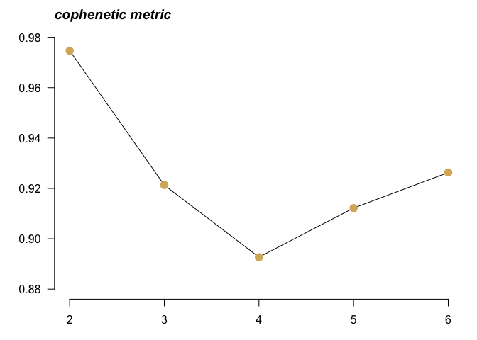<!-- -->

``` r
# Best possible value is the one at which the correlation value on the y-axis drops significantly. In this case it appears to be at n = 3.
```

Once n is estimated, we can run the main function.

``` r
laml.sig = extractSignatures(mat = laml.tnm, n = 3, pConstant = 0.1)
```

    ## -Running NMF for factorization rank: 3

    ## -Finished in13.6s elapsed (4.031s cpu)

Compare detected signatures to known signatures from COSMIC database.

``` r
#Compate against original 30 signatures 
laml.og30.cosm = compareSignatures(nmfRes = laml.sig, sig_db = "legacy")
```

    ## -Comparing against COSMIC signatures

    ## ------------------------------------

    ## --Found Signature_1 most similar to COSMIC_1

    ##    Aetiology: spontaneous deamination of 5-methylcytosine [cosine-similarity: 0.84]

    ## --Found Signature_2 most similar to COSMIC_1

    ##    Aetiology: spontaneous deamination of 5-methylcytosine [cosine-similarity: 0.577]

    ## --Found Signature_3 most similar to COSMIC_5

    ##    Aetiology: Unknown [cosine-similarity: 0.851]

    ## ------------------------------------

``` r
#Compate against updated version3 60 signatures 
laml.v3.cosm = compareSignatures(nmfRes = laml.sig, sig_db = "SBS")
```

    ## -Comparing against COSMIC signatures

    ## ------------------------------------

    ## --Found Signature_1 most similar to SBS1

    ##    Aetiology: spontaneous or enzymatic deamination of 5-methylcytosine [cosine-similarity: 0.858]

    ## --Found Signature_2 most similar to SBS6

    ##    Aetiology: defective DNA mismatch repair [cosine-similarity: 0.538]

    ## --Found Signature_3 most similar to SBS3

    ##    Aetiology: Defects in DNA-DSB repair by HR [cosine-similarity: 0.836]

    ## ------------------------------------

``` r
# compareSignatures returns full table of cosine similarities against COSMIC signatures, which can be further analysed. Below plot shows comparison of similarities of detected signatures against validated signatures.
library('pheatmap')
pheatmap::pheatmap(mat = laml.og30.cosm$cosine_similarities, cluster_rows = FALSE, main = "cosine similarity against validated signatures")
```

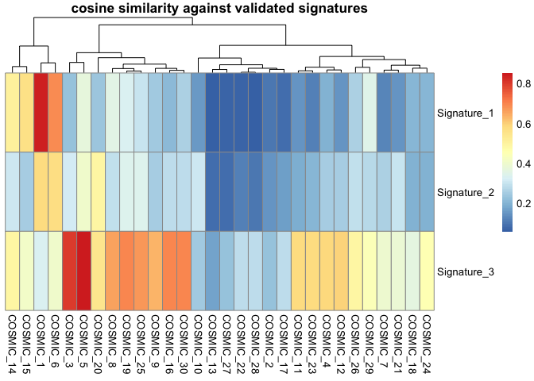<!-- -->

``` r
# Finally plot signatures
maftools::plotSignatures(nmfRes = laml.sig, title_size = 0.8)
```

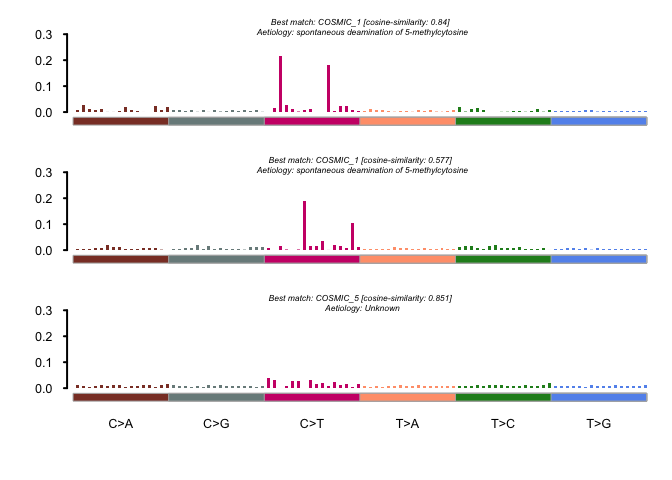<!-- -->

``` r
# Signatures can further be assigned to samples and enrichment analysis can be performd using signatureEnrichment funtion, which identifies mutations enriched in every signature identified.
laml.se = signatureEnrichment(maf = laml, sig_res = laml.sig)
```

    ## Running k-means for signature assignment..

    ## Performing pairwise and groupwise comparisions..

    ## Sample size per factor in Signature:

    ## 
    ## Signature_1 Signature_2 Signature_3 
    ##          60          65          63

    ## Estimating mutation load and signature exposures..

<!-- -->

``` r
# Above results can be visualzied similar to clinical enrichments.
plotEnrichmentResults(enrich_res = laml.se, pVal = 0.05)
```

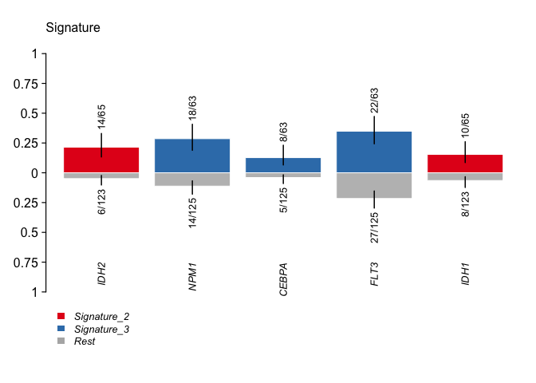<!-- -->

## Citations

<div id="refs" class="references">

<div id="ref-Alexandrov">

Alexandrov, Ludmil B., Serena Nik-Zainal, David C. Wedge, Samuel A. J.
R. Aparicio, Sam Behjati, Andrew V. Biankin, Graham R. Bignell, et al.
2013. “Signatures of Mutational Processes in Human Cancer.” *Nature* 500
(7463): 415–21. <https://doi.org/10.1038/nature12477>.

</div>

<div id="ref-Cotto">

Cotto, Kelsy C., Alex H. Wagner, Yang-Yang Feng, Susanna Kiwala, Adam C.
Coffman, Gregory Spies, Alex Wollam, Nicholas C. Spies, Obi L. Griffith,
and Malachi Griffith. 2017. “DGIdb 3.0: A Redesign and Expansion of the
Drug–Gene Interaction Database.” *Nucleic Acids Research* 46 (D1):
D1068–D1073. <https://doi.org/10.1093/nar/gkx1143>.

</div>

<div id="ref-Griffith">

Griffith, Malachi, Obi L. Griffith, Adam C. Coffman, James V. Weible,
Josh F. McMichael, Nicholas C. Spies, James Koval, et al. 2013. “DGIdb:
Mining the Druggable Genome.” *Nature Methods* 10 (12): 1209–10.
<https://doi.org/10.1038/nmeth.2689>.

</div>

<div id="ref-Mayakonda">

Mayakonda, Anand, De-Chen Lin, Yassen Assenov, Christoph Plass, and H.
Phillip Koeffler. 2018. “Maftools: Efficient and Comprehensive Analysis
of Somatic Variants in Cancer.” *Genome Research* 28 (11). Cold Spring
Harbor Laboratory Press: 1747–56.
<https://doi.org/10.1101/gr.239244.118>.

</div>

<div id="ref-Ley">

Network, Cancer Genome Atlas Research, Timothy J. Ley, Christopher
Miller, Li Ding, Benjamin J. Raphael, Andrew J. Mungall, A. Gordon
Robertson, et al. 2013. “Genomic and Epigenomic Landscapes of Adult de
Novo Acute Myeloid Leukemia.” *The New England Journal of Medicine* 368
(22): 2059–74. <https://doi.org/10.1056/NEJMoa1301689>.

</div>

<div id="ref-Roberts">

Roberts, Steven A., Michael S. Lawrence, Leszek J. Klimczak, Sara A.
Grimm, David Fargo, Petar Stojanov, Adam Kiezun, et al. 2013. “An APOBEC
Cytidine Deaminase Mutagenesis Pattern Is Widespread in Human Cancers.”
*Nature Genetics* 45 (9): 970–76. <https://doi.org/10.1038/ng.2702>.

</div>

<div id="ref-Tamborero">

Tamborero, David, Abel Gonzalez-Perez, and Nuria Lopez-Bigas. 2013.
“OncodriveCLUST: Exploiting the Positional Clustering of Somatic
Mutations to Identify Cancer Genes.” *Bioinformatics* 29 (18): 2238–44.
<https://doi.org/10.1093/bioinformatics/btt395>.

</div>

</div>
