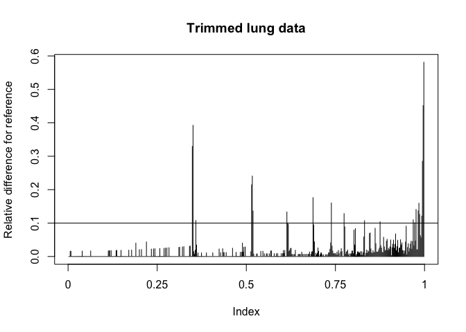
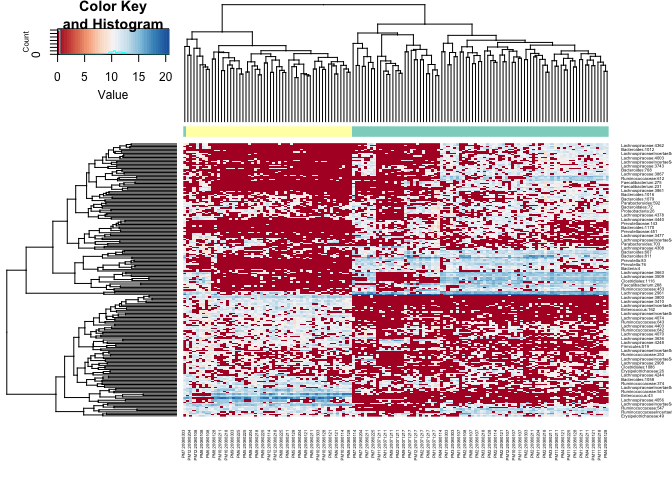
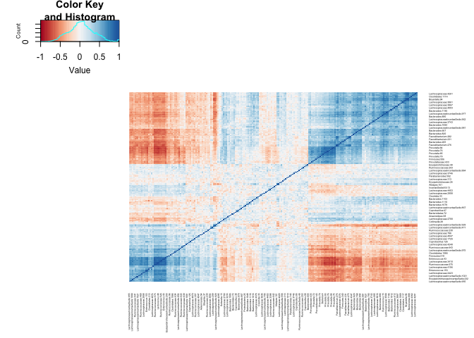
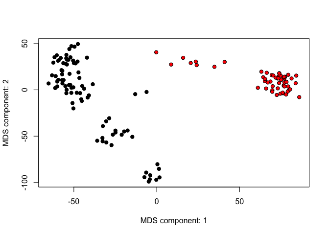
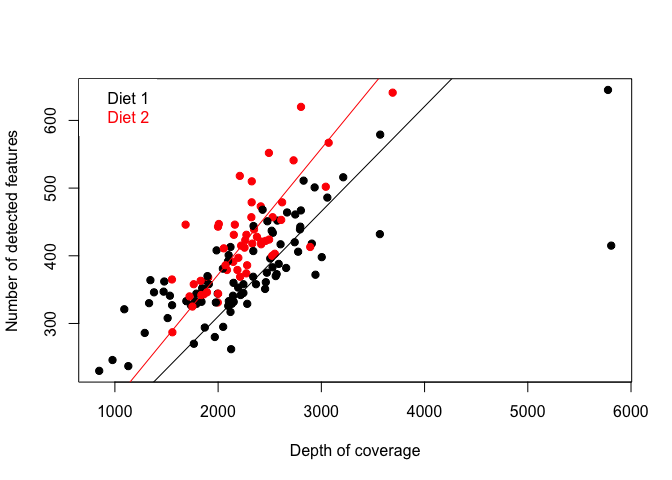
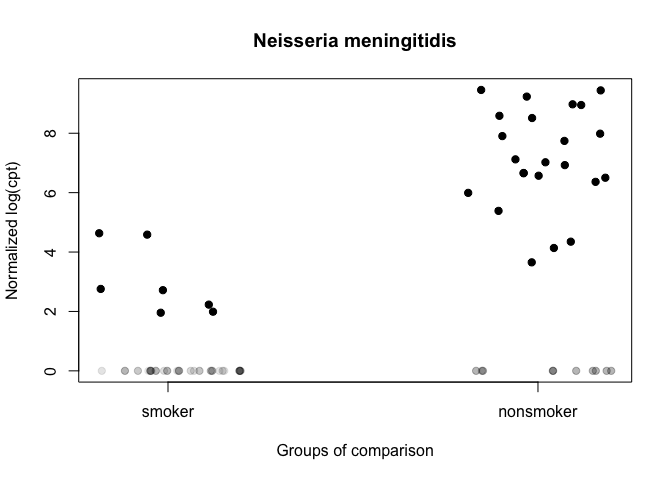
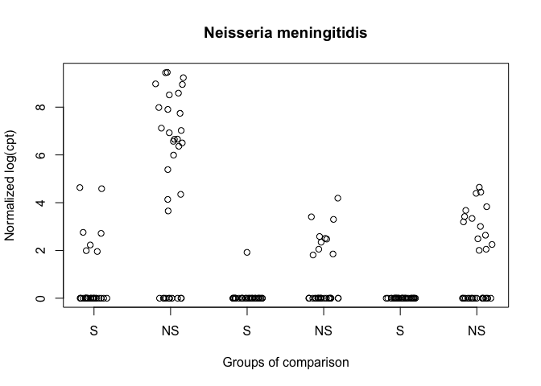
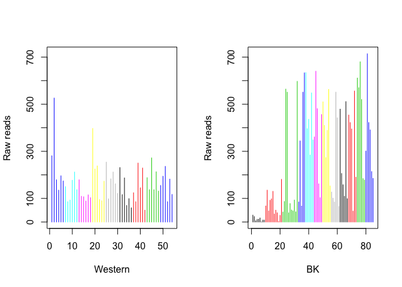

Lung Metagenomic Analysis
================
Joseph Kheir
3/28/2020

## Load required data and libraries

``` r
library(metagenomeSeq)
```

    ## Loading required package: Biobase

    ## Loading required package: BiocGenerics

    ## Loading required package: parallel

    ## 
    ## Attaching package: 'BiocGenerics'

    ## The following objects are masked from 'package:parallel':
    ## 
    ##     clusterApply, clusterApplyLB, clusterCall, clusterEvalQ,
    ##     clusterExport, clusterMap, parApply, parCapply, parLapply,
    ##     parLapplyLB, parRapply, parSapply, parSapplyLB

    ## The following objects are masked from 'package:stats':
    ## 
    ##     IQR, mad, sd, var, xtabs

    ## The following objects are masked from 'package:base':
    ## 
    ##     anyDuplicated, append, as.data.frame, basename, cbind, colnames,
    ##     dirname, do.call, duplicated, eval, evalq, Filter, Find, get, grep,
    ##     grepl, intersect, is.unsorted, lapply, Map, mapply, match, mget,
    ##     order, paste, pmax, pmax.int, pmin, pmin.int, Position, rank,
    ##     rbind, Reduce, rownames, sapply, setdiff, sort, table, tapply,
    ##     union, unique, unsplit, which, which.max, which.min

    ## Welcome to Bioconductor
    ## 
    ##     Vignettes contain introductory material; view with
    ##     'browseVignettes()'. To cite Bioconductor, see
    ##     'citation("Biobase")', and for packages 'citation("pkgname")'.

    ## Loading required package: limma

    ## 
    ## Attaching package: 'limma'

    ## The following object is masked from 'package:BiocGenerics':
    ## 
    ##     plotMA

    ## Loading required package: glmnet

    ## Loading required package: Matrix

    ## Loaded glmnet 3.0-2

    ## Loading required package: RColorBrewer

``` r
library(biomformat)
data(lungData)
data(mouseData)
```

## Load the Data

``` r
# Load count data
dataDirectory <- system.file("extdata", package = "metagenomeSeq")
lung = loadMeta(file.path(dataDirectory, "CHK_NAME.otus.count.csv"))
dim(lung$counts)
```

    ## [1] 1000   78

``` r
# Load taxonomy
taxa = read.delim(file.path(dataDirectory, "CHK_otus.taxonomy.csv"),
stringsAsFactors = FALSE)

# Load metadata
clin = loadPhenoData(file.path(dataDirectory, "CHK_clinical.csv"),
tran = TRUE)
ord = match(colnames(lung$counts), rownames(clin))
clin = clin[ord, ]
head(clin[1:2, ])
```

    ##                                          SampleType          SiteSampled
    ## CHK_6467_E3B11_BRONCH2_PREWASH_V1V2 Bronch2.PreWash Bronchoscope.Channel
    ## CHK_6467_E3B11_OW_V1V2                           OW           OralCavity
    ##                                     SmokingStatus
    ## CHK_6467_E3B11_BRONCH2_PREWASH_V1V2        Smoker
    ## CHK_6467_E3B11_OW_V1V2                     Smoker

``` r
# Creat a MRexperiment object
phenotypeData = AnnotatedDataFrame(clin)
phenotypeData
```

    ## An object of class 'AnnotatedDataFrame'
    ##   rowNames: CHK_6467_E3B11_BRONCH2_PREWASH_V1V2 CHK_6467_E3B11_OW_V1V2
    ##     ... CHK_6467_E3B09_BAL_A_V1V2 (78 total)
    ##   varLabels: SampleType SiteSampled SmokingStatus
    ##   varMetadata: labelDescription

``` r
OTUdata = AnnotatedDataFrame(taxa)
OTUdata
```

    ## An object of class 'AnnotatedDataFrame'
    ##   rowNames: 1 2 ... 1000 (1000 total)
    ##   varLabels: OTU Taxonomy ... strain (10 total)
    ##   varMetadata: labelDescription

``` r
obj = newMRexperiment(lung$counts,phenoData=phenotypeData,featureData=OTUdata)
obj
```

    ## MRexperiment (storageMode: environment)
    ## assayData: 1000 features, 78 samples 
    ##   element names: counts 
    ## protocolData: none
    ## phenoData
    ##   sampleNames: CHK_6467_E3B11_BRONCH2_PREWASH_V1V2
    ##     CHK_6467_E3B11_OW_V1V2 ... CHK_6467_E3B09_BAL_A_V1V2 (78 total)
    ##   varLabels: SampleType SiteSampled SmokingStatus
    ##   varMetadata: labelDescription
    ## featureData
    ##   featureNames: 1 2 ... 1000 (1000 total)
    ##   fvarLabels: OTU Taxonomy ... strain (10 total)
    ##   fvarMetadata: labelDescription
    ## experimentData: use 'experimentData(object)'
    ## Annotation:

## Useful commands

``` r
# How to access phenotype information
phenoData(obj)
```

    ## An object of class 'AnnotatedDataFrame'
    ##   sampleNames: CHK_6467_E3B11_BRONCH2_PREWASH_V1V2
    ##     CHK_6467_E3B11_OW_V1V2 ... CHK_6467_E3B09_BAL_A_V1V2 (78 total)
    ##   varLabels: SampleType SiteSampled SmokingStatus
    ##   varMetadata: labelDescription

``` r
head(pData(obj), 3)
```

    ##                                          SampleType          SiteSampled
    ## CHK_6467_E3B11_BRONCH2_PREWASH_V1V2 Bronch2.PreWash Bronchoscope.Channel
    ## CHK_6467_E3B11_OW_V1V2                           OW           OralCavity
    ## CHK_6467_E3B08_OW_V1V2                           OW           OralCavity
    ##                                     SmokingStatus
    ## CHK_6467_E3B11_BRONCH2_PREWASH_V1V2        Smoker
    ## CHK_6467_E3B11_OW_V1V2                     Smoker
    ## CHK_6467_E3B08_OW_V1V2                  NonSmoker

``` r
# How to access feature information
featureData(obj)
```

    ## An object of class 'AnnotatedDataFrame'
    ##   featureNames: 1 2 ... 1000 (1000 total)
    ##   varLabels: OTU Taxonomy ... strain (10 total)
    ##   varMetadata: labelDescription

``` r
head(fData(obj) [, -c(2, 10)], 3)
```

    ##   OTU superkingdom         phylum                  class             order
    ## 1   1     Bacteria Proteobacteria  Epsilonproteobacteria Campylobacterales
    ## 2   2         <NA>           <NA>                   <NA>              <NA>
    ## 3   3     Bacteria Actinobacteria Actinobacteria (class)   Actinomycetales
    ##               family         genus                  species
    ## 1 Campylobacteraceae Campylobacter     Campylobacter rectus
    ## 2               <NA>          <NA>                     <NA>
    ## 3   Actinomycetaceae   Actinomyces Actinomyces radicidentis

``` r
# How to access raw/ normalized counts
head(MRcounts(obj[, 1:2]))
```

    ##   CHK_6467_E3B11_BRONCH2_PREWASH_V1V2 CHK_6467_E3B11_OW_V1V2
    ## 1                                   0                      0
    ## 2                                   0                      0
    ## 3                                   0                      0
    ## 4                                   0                      0
    ## 5                                   0                      0
    ## 6                                   0                      0

``` r
# How to subset a MRexperiment-class object
featuresToKeep = which(rowSums(obj) >= 100)
samplesToKeep = which(pData(obj)$SmokingStatus == "Smoker")
obj_smokers = obj[featuresToKeep, samplesToKeep]
obj_smokers
```

    ## MRexperiment (storageMode: environment)
    ## assayData: 1 features, 33 samples 
    ##   element names: counts 
    ## protocolData: none
    ## phenoData
    ##   sampleNames: CHK_6467_E3B11_BRONCH2_PREWASH_V1V2
    ##     CHK_6467_E3B11_OW_V1V2 ... CHK_6467_E3B09_BAL_A_V1V2 (33 total)
    ##   varLabels: SampleType SiteSampled SmokingStatus
    ##   varMetadata: labelDescription
    ## featureData
    ##   featureNames: 570
    ##   fvarLabels: OTU Taxonomy ... strain (10 total)
    ##   fvarMetadata: labelDescription
    ## experimentData: use 'experimentData(object)'
    ## Annotation:

``` r
head(pData(obj_smokers), 3)
```

    ##                                          SampleType          SiteSampled
    ## CHK_6467_E3B11_BRONCH2_PREWASH_V1V2 Bronch2.PreWash Bronchoscope.Channel
    ## CHK_6467_E3B11_OW_V1V2                           OW           OralCavity
    ## CHK_6467_E3B11_BAL_A_V1V2                     BAL.A                 Lung
    ##                                     SmokingStatus
    ## CHK_6467_E3B11_BRONCH2_PREWASH_V1V2        Smoker
    ## CHK_6467_E3B11_OW_V1V2                     Smoker
    ## CHK_6467_E3B11_BAL_A_V1V2                  Smoker

``` r
# Alternative normalization scaling factors
head(normFactors(obj))
```

    ##                                     [,1]
    ## CHK_6467_E3B11_BRONCH2_PREWASH_V1V2   NA
    ## CHK_6467_E3B11_OW_V1V2                NA
    ## CHK_6467_E3B08_OW_V1V2                NA
    ## CHK_6467_E3B07_BAL_A_V1V2             NA
    ## CHK_6467_E3B11_BAL_A_V1V2             NA
    ## CHK_6467_E3B09_OP_V1V2                NA

``` r
normFactors(obj) <- rnorm(ncol(obj))
head(normFactors(obj))
```

    ## CHK_6467_E3B11_BRONCH2_PREWASH_V1V2              CHK_6467_E3B11_OW_V1V2 
    ##                           1.4402863                          -0.8187653 
    ##              CHK_6467_E3B08_OW_V1V2           CHK_6467_E3B07_BAL_A_V1V2 
    ##                           1.2747048                          -1.7293298 
    ##           CHK_6467_E3B11_BAL_A_V1V2              CHK_6467_E3B09_OP_V1V2 
    ##                          -0.4133317                          -0.3119452

``` r
# How to access library sizes
head(libSize(obj))
```

    ##                                     [,1]
    ## CHK_6467_E3B11_BRONCH2_PREWASH_V1V2    0
    ## CHK_6467_E3B11_OW_V1V2                16
    ## CHK_6467_E3B08_OW_V1V2                 1
    ## CHK_6467_E3B07_BAL_A_V1V2              2
    ## CHK_6467_E3B11_BAL_A_V1V2            118
    ## CHK_6467_E3B09_OP_V1V2                 5

``` r
libSize(obj) <- rnorm(ncol(obj))
head(libSize(obj))
```

    ## CHK_6467_E3B11_BRONCH2_PREWASH_V1V2              CHK_6467_E3B11_OW_V1V2 
    ##                          1.13718966                         -2.12627230 
    ##              CHK_6467_E3B08_OW_V1V2           CHK_6467_E3B07_BAL_A_V1V2 
    ##                         -0.43519044                         -0.51492627 
    ##           CHK_6467_E3B11_BAL_A_V1V2              CHK_6467_E3B09_OP_V1V2 
    ##                         -0.21256694                         -0.05698659

``` r
# Filter data to maintain minimum depth threshold
data(mouseData)
filterData(mouseData, present = 10, depth = 1000)
```

    ## MRexperiment (storageMode: environment)
    ## assayData: 1057 features, 137 samples 
    ##   element names: counts 
    ## protocolData: none
    ## phenoData
    ##   sampleNames: PM1:20080108 PM1:20080114 ... PM9:20080303 (137 total)
    ##   varLabels: mouseID date ... status (5 total)
    ##   varMetadata: labelDescription
    ## featureData
    ##   featureNames: Erysipelotrichaceae:8 Lachnospiraceae:129 ...
    ##     Collinsella:34 (1057 total)
    ##   fvarLabels: superkingdom phylum ... OTU (7 total)
    ##   fvarMetadata: labelDescription
    ## experimentData: use 'experimentData(object)'
    ## Annotation:

``` r
# How to merge two MRexperiment-class objects
newobj = mergeMRexperiments(mouseData, mouseData)
```

    ## MRexperiment 1 and 2 share sample ids; adding labels to sample ids.

## Normalization

``` r
# Calculating normalization factors
p = cumNormStatFast(lungData)
lungData = cumNorm(lungData, p = p) # To calculate normalization factors

# Calculating normalization factors using wrench
condition = mouseData$diet
mouseData = wrenchNorm(mouseData, condition = condition)
```

    ## Warning: glm.fit: algorithm did not converge

    ## Warning: glm.fit: fitted probabilities numerically 0 or 1 occurred

    ## Warning: glm.fit: algorithm did not converge

    ## Warning: glm.fit: fitted probabilities numerically 0 or 1 occurred

    ## Warning: Partial NA coefficients for 8430 probe(s)

``` r
# Exporting data
# Export normalized count matrices
mat = MRcounts(lungData, norm = TRUE, log = TRUE)[1:5, 1:5]
exportMat(mat, file = file.path(dataDirectory, "tmp.tsv"))
# Save sample statistics
exportStats(lungData[, 1:5], file = file.path(dataDirectory, "tmp.tsv"))
```

    ## Default value being used.

``` r
head(read.csv(file = file.path(dataDirectory, "tmp.tsv"), sep = "\t"))
```

    ##                               Subject Scaling.factor Quantile.value
    ## 1 CHK_6467_E3B11_BRONCH2_PREWASH_V1V2             67              2
    ## 2              CHK_6467_E3B11_OW_V1V2           2475              1
    ## 3              CHK_6467_E3B08_OW_V1V2           2198              1
    ## 4           CHK_6467_E3B07_BAL_A_V1V2            836              1
    ## 5           CHK_6467_E3B11_BAL_A_V1V2           1008              1
    ##   Number.of.identified.features Library.size
    ## 1                            60          271
    ## 2                          3299         7863
    ## 3                          2994         8360
    ## 4                          1188         5249
    ## 5                          1098         3383

## Statistical testing

``` r
# Using the fitFeatureModel
lungData = lungData[, -which(is.na(pData(lungData)$SmokingStatus))]
lungData = filterData(lungData, present = 30, depth = 1)
lungData <- cumNorm(lungData, p = 0.5)
pd <- pData(lungData)
mod <- model.matrix(~1 + SmokingStatus, data = pd)
lungres1 = fitFeatureModel(lungData, mod)
head(MRcoefs(lungres1))
```

    ##           logFC        se      pvalues   adjPvalues
    ## 3465  -4.824949 0.5697511 0.000000e+00 0.000000e+00
    ## 35827 -4.304266 0.5445548 2.664535e-15 1.079137e-13
    ## 2817   2.320656 0.4324661 8.045793e-08 1.629273e-06
    ## 2735   2.260203 0.4331098 1.803341e-07 2.921412e-06
    ## 5411   1.748296 0.3092461 1.572921e-08 4.246888e-07
    ## 48745 -1.645805 0.3293117 5.801451e-07 7.831959e-06

``` r
# Using fitZip for differential abundance
data(lungData)
controls = grep("Extraction.Control", pData(lungData)$SampleType)
lungTrim = lungData[, -controls]
rareFeatures = which(rowSums(MRcounts(lungTrim) > 0) < 10)
lungTrim = lungTrim[-rareFeatures, ]
lungp = cumNormStat(lungTrim, pFlag = TRUE, main = "Trimmed lung data")
```

    ## Default value being used.

<!-- -->

``` r
lungTrim = cumNorm(lungTrim, p = lungp)

smokingStatus = pData(lungTrim)$SmokingStatus
bodySite = pData(lungTrim)$SampleType
normFactor = normFactors(lungTrim)
normFactor = log2(normFactor/median(normFactor) + 1)
mod = model.matrix(~smokingStatus + bodySite + normFactor)
settings = zigControl(maxit = 10, verbose = TRUE)
fit = fitZig(obj = lungTrim, mod = mod, useCSSoffset = FALSE, control = settings)
```

    ## it= 0, nll=88.42, log10(eps+1)=Inf, stillActive=1029
    ## it= 1, nll=93.56, log10(eps+1)=0.06, stillActive=261
    ## it= 2, nll=93.46, log10(eps+1)=0.05, stillActive=120
    ## it= 3, nll=93.80, log10(eps+1)=0.05, stillActive=22
    ## it= 4, nll=93.94, log10(eps+1)=0.03, stillActive=3
    ## it= 5, nll=93.93, log10(eps+1)=0.00, stillActive=1
    ## it= 6, nll=93.90, log10(eps+1)=0.00, stillActive=1
    ## it= 7, nll=93.87, log10(eps+1)=0.00, stillActive=1
    ## it= 8, nll=93.86, log10(eps+1)=0.00, stillActive=1
    ## it= 9, nll=93.85, log10(eps+1)=0.00, stillActive=1

``` r
# Using Limma's topTable function for F-test on Multiple Groups
settings = zigControl(maxit = 1, verbose = FALSE)
mod = model.matrix(~bodySite)
colnames(mod) = levels(bodySite)
res = fitZig(obj = lungTrim, mod = mod, control = settings)
zigFit = slot(res, "fit")
finalMod = slot(res, "fit")$design
contrast.matrix = makeContrasts(BAL.A - BAL.B, OW - PSB, levels = finalMod)
fit2 = contrasts.fit(zigFit, contrast.matrix)
fit2 = eBayes(fit2)
topTable(fit2)
```

    ##       BAL.A...BAL.B  OW...PSB   AveExpr         F      P.Value  adj.P.Val
    ## 18531    0.37318792  2.075648 0.7343081 12.715105 5.359780e-05 0.02813711
    ## 6291    -0.10695735  1.658829 0.4671470 12.956898 5.482439e-05 0.02813711
    ## 37977   -0.37995461  2.174071 0.4526060 12.528733 8.203239e-05 0.02813711
    ## 6901     0.17344138  1.466113 0.2435881 12.018652 1.335806e-04 0.03212047
    ## 40291    0.06892926  1.700238 0.2195735 11.803380 1.560761e-04 0.03212047
    ## 36117   -0.28665883  2.233996 0.4084024 10.571931 3.012092e-04 0.05013569
    ## 7343    -0.22859078  1.559465 0.3116465 10.090602 3.931844e-04 0.05013569
    ## 7342     0.59882970  1.902346 0.5334647  9.410984 4.901651e-04 0.05013569
    ## 1727     1.09837459 -2.160466 0.7780167  9.346013 5.027597e-04 0.05013569
    ## 40329   -0.07145998  1.481582 0.2475735  9.700136 5.259032e-04 0.05013569

``` r
# Exporting fits
taxa = sapply(strsplit(as.character(fData(lungTrim)$taxa), split = ";"),
function(i) {
i[length(i)]
})
head(MRcoefs(fit, taxa = taxa, coef = 2))
```

    ##                                   smokingStatusSmoker      pvalues   adjPvalues
    ## Neisseria polysaccharea                     -4.031612 3.927097e-11 2.959194e-08
    ## Neisseria meningitidis                      -3.958899 5.751592e-11 2.959194e-08
    ## Prevotella intermedia                       -2.927686 4.339587e-09 8.930871e-07
    ## Porphyromonas sp. UQD 414                   -2.675306 1.788697e-07 1.357269e-05
    ## Prevotella paludivivens                      2.575672 1.360718e-07 1.272890e-05
    ## Leptotrichia sp. oral clone FP036            2.574172 3.544957e-04 1.414122e-03

``` r
# Log normal permutation test
coeffOfInterest = 2
res = fitLogNormal(obj = lungTrim, mod = mod, useCSSoffset = FALSE,
B = 10, coef = coeffOfInterest)
# extract p.values and adjust for multiple testing res$p are
# the p-values calculated through permutation
adjustedPvalues = p.adjust(res$p, method = "fdr")
# extract the absolute fold-change estimates
foldChange = abs(res$fit$coef[, coeffOfInterest])
# determine features still significant and order by the
sigList = which(adjustedPvalues <= 0.05)
sigList = sigList[order(foldChange[sigList])]
# view the top taxa associated with the coefficient of
# interest.
head(taxa[sigList])
```

    ## [1] "Veillonella montpellierensis" "Anaeroglobus geminatus"      
    ## [3] "Veillonella rodentium"        "Actinomyces sp."             
    ## [5] "Listeria grayi"               "Prevotella pallens"

``` r
# Presence-absence testing
classes = pData(mouseData)$diet
res = fitPA(mouseData[1:5, ], cl = classes)
# Warning - the p-value is calculating 1 despite a high odd's
# ratio.
head(res)
```

    ##                         oddsRatio      lower    upper   pvalues adjPvalues
    ## Prevotellaceae:1              Inf 0.01630496      Inf 1.0000000          1
    ## Lachnospiraceae:1             Inf 0.01630496      Inf 1.0000000          1
    ## Unclassified-Screened:1       Inf 0.01630496      Inf 1.0000000          1
    ## Clostridiales:1                 0 0.00000000 24.77661 0.3884892          1
    ## Clostridiales:2               Inf 0.01630496      Inf 1.0000000          1

``` r
# Discovery odds ratio testing
classes = pData(mouseData)$diet
res = fitDO(mouseData[1:100, ], cl = classes, norm = FALSE, log = FALSE)
head(res)
```

    ##                         oddsRatio      lower    upper   pvalues adjPvalues
    ## Prevotellaceae:1              Inf 0.01630496      Inf 1.0000000  1.0000000
    ## Lachnospiraceae:1             Inf 0.01630496      Inf 1.0000000  1.0000000
    ## Unclassified-Screened:1       Inf 0.01630496      Inf 1.0000000  1.0000000
    ## Clostridiales:1                 0 0.00000000 24.77661 0.3884892  0.7470946
    ## Clostridiales:2               Inf 0.01630496      Inf 1.0000000  1.0000000
    ## Firmicutes:1                    0 0.00000000 24.77661 0.3884892  0.7470946

``` r
# Feature correlations abundance testing
cors = correlationTest(mouseData[55:60, ], norm = FALSE, log = FALSE)
head(cors)
```

    ##                                     correlation            p
    ## Clostridiales:11-Lachnospiraceae:35 -0.02205882 7.965979e-01
    ## Clostridiales:11-Coprobacillus:3    -0.01701180 8.424431e-01
    ## Clostridiales:11-Lactobacillales:3  -0.01264304 8.825644e-01
    ## Clostridiales:11-Enterococcaceae:3   0.57315130 1.663001e-13
    ## Clostridiales:11-Enterococcaceae:4  -0.01264304 8.825644e-01
    ## Lachnospiraceae:35-Coprobacillus:3   0.24572606 3.548360e-03

``` r
# Unique OTUs or features
cl = pData(mouseData)[["diet"]]
uniqueFeatures(mouseData, cl, nsamples = 10, nreads = 100)
```

    ##                      featureIndices Samp. in BK Samp. in Western Reads in BK
    ## Enterococcaceae:28             2458           0               36           0
    ## Lachnospiraceae:1453           2826          16                0         192
    ## Firmicutes:367                 4165           0               32           0
    ## Prevotellaceae:143             7030          50                0         109
    ## Lachnospiraceae:4122           7844          15                0         505
    ## Enterococcus:182               8384           0               34           0
    ## Lachnospiraceae:4347           8668          50                0         130
    ## Prevotella:79                  8749          50                0         100
    ## Prevotella:81                  8994          71                0         370
    ## Prevotellaceae:433             9223          53                0         154
    ##                      Reads in Western
    ## Enterococcaceae:28                123
    ## Lachnospiraceae:1453                0
    ## Firmicutes:367                    112
    ## Prevotellaceae:143                  0
    ## Lachnospiraceae:4122                0
    ## Enterococcus:182                  163
    ## Lachnospiraceae:4347                0
    ## Prevotella:79                       0
    ## Prevotella:81                       0
    ## Prevotellaceae:433                  0

## Aggregating counts

``` r
# Aggregate the count matrix regardless of normalization
obj = aggTax(mouseData, lvl = "phylum", out = "matrix")
head(obj[1:5, 1:5])
```

    ##                PM1:20080107 PM1:20080108 PM1:20080114 PM1:20071211 PM1:20080121
    ## Actinobacteria            0            3            2           37            0
    ## Bacteroidetes           486          921         1103          607          818
    ## Cyanobacteria             0            0            0            0            0
    ## Firmicutes              455          922         1637          772         1254
    ## NA                        5           25            5            8            4

``` r
# The function phenoData can also be used to aggregate counts
obj = aggSamp(mouseData, fct = "mouseID", out = "matrix")
head(obj[1:5, 1:5])
```

    ##                         PM1 PM10       PM11 PM12 PM2
    ## Prevotellaceae:1          0    0 0.00000000    0   0
    ## Lachnospiraceae:1         0    0 0.00000000    0   0
    ## Unclassified-Screened:1   0    0 0.08333333    0   0
    ## Clostridiales:1           0    0 0.00000000    0   0
    ## Clostridiales:2           0    0 0.00000000    0   0

## Visualization of features

``` r
# How to create a heatmap & hierarchical clustering of log 
# transformed counts
trials = pData(mouseData)$diet
heatmapColColors = brewer.pal(12, "Set3")[as.integer(factor(trials))]
heatmapCols = colorRampPalette(brewer.pal(9, "RdBu"))(50)
# plotMRheatmap
plotMRheatmap(obj = mouseData, n = 200, cexRow = 0.4, cexCol = 0.4,
trace = "none", col = heatmapCols, ColSideColors = heatmapColColors)
```

<!-- -->

``` r
# plotCorr
plotCorr(obj = mouseData, n = 200, cexRow = 0.25, cexCol = 0.25,
trace = "none", dendrogram = "none", col = heatmapCols)
```

<!-- -->

``` r
# How to plot CMDS plots
cl = factor(pData(mouseData)$diet)
# plotOrd - can load vegan and set distfun = vegdist and use
# dist.method='bray'
plotOrd(mouseData, tran = TRUE, usePCA = FALSE, useDist = TRUE,
bg = cl, pch = 21)
```

<!-- -->

``` r
# plotRare
res = plotRare(mouseData, cl = cl, pch = 21, bg = cl)
# Linear fits for plotRare / legend
tmp = lapply(levels(cl), function(lv) lm(res[, "ident"] ~ res[,
"libSize"] - 1, subset = cl == lv))
for (i in 1:length(levels(cl))) {
abline(tmp[[i]], col = i)
}
legend("topleft", c("Diet 1", "Diet 2"), text.col = c(1, 2),
box.col = NA)
```

<!-- -->

``` r
# Using plotOTU to plot the normalized log(cpt) of a specific OTU
head(MRtable(fit, coef = 2, taxa = 1:length(fData(lungTrim)$taxa)))
```

    ##     +samples in group 0 +samples in group 1 counts in group 0 counts in group 1
    ## 63                   24                   6              1538                11
    ## 779                  23                   7              1512                22
    ## 358                  24                   1               390                 1
    ## 499                  21                   2               326                 2
    ## 25                   15                  26               162              1893
    ## 928                   2                  11                 4                91
    ##     smokingStatusSmoker      pvalues   adjPvalues
    ## 63            -4.031612 3.927097e-11 2.959194e-08
    ## 779           -3.958899 5.751592e-11 2.959194e-08
    ## 358           -2.927686 4.339587e-09 8.930871e-07
    ## 499           -2.675306 1.788697e-07 1.357269e-05
    ## 25             2.575672 1.360718e-07 1.272890e-05
    ## 928            2.574172 3.544957e-04 1.414122e-03

``` r
patients = sapply(strsplit(rownames(pData(lungTrim)), split = "_"),
function(i) {
i[3]
})
pData(lungTrim)$patients = patients
classIndex = list(smoker = which(pData(lungTrim)$SmokingStatus ==
"Smoker"))
classIndex$nonsmoker = which(pData(lungTrim)$SmokingStatus ==
"NonSmoker")
otu = 779
# plotOTU
plotOTU(lungTrim, otu = otu, classIndex, main = "Neisseria meningitidis")
```

<!-- -->

``` r
# Now multiple OTUs annotated similarly
x = fData(lungTrim)$taxa[otu]
otulist = grep(x, fData(lungTrim)$taxa)
# plotGenus
plotGenus(lungTrim, otulist, classIndex, labs = FALSE, main = "Neisseria meningitidis")
lablist <- c("S", "NS")
axis(1, at = seq(1, 6, by = 1), labels = rep(lablist, times = 3))
```

<!-- -->

``` r
classIndex = list(Western = which(pData(mouseData)$diet == "Western"))
classIndex$BK = which(pData(mouseData)$diet == "BK")
otuIndex = 8770
par(mfrow=c(1,2))
dates = pData(mouseData)$date
plotFeature(mouseData, norm = FALSE, log = FALSE, otuIndex, classIndex,
col = dates, sortby = dates, ylab = "Raw reads")
```

<!-- --> \#\# Citing
metagenomeSeq

``` r
citation("metagenomeSeq")
```

    ## 
    ## Please cite the top for the original statistical method and
    ## normalization method implemented in metagenomeSeq and the bottom for
    ## the software/vignette guide. Time series analysis/function is described
    ## in the third citation.
    ## 
    ##   JN Paulson, OC Stine, HC Bravo, M Pop.  Differential abundance
    ##   analysis for microbial marker-gene surveys. Nat Meth Accepted
    ## 
    ##   JN Paulson, H Talukder, M Pop, HC Bravo. metagenomeSeq: Statistical
    ##   analysis for sparse high-throughput sequencing. Bioconductor package:
    ##   1.26.3. http://cbcb.umd.edu/software/metagenomeSeq
    ## 
    ##   H Talukder*, JN Paulson*, HC Bravo. Longitudinal differential
    ##   abundance analysis of marker-gene surveys. Submitted
    ## 
    ## To see these entries in BibTeX format, use 'print(<citation>,
    ## bibtex=TRUE)', 'toBibtex(.)', or set
    ## 'options(citation.bibtex.max=999)'.
